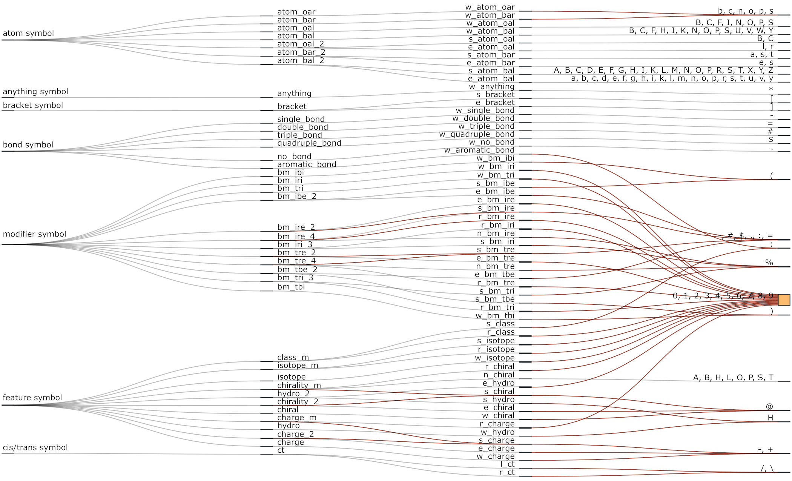
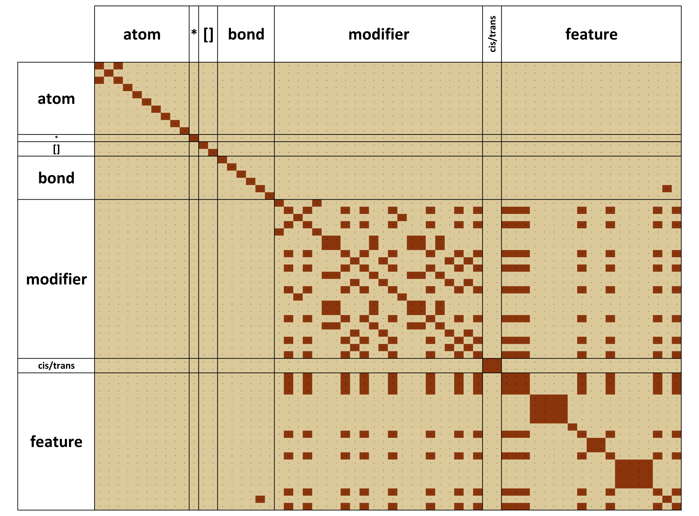

# SMILES Parser (work in progress)

For the SMILES (Simplified Molecular Input Line Entry System) reference, please, SEE:

-   <https://www.daylight.com/dayhtml/doc/theory/theory.smiles.html>

-   <http://opensmiles.org/opensmiles.html>

-   <https://en.wikipedia.org/wiki/Simplified_Molecular_Input_Line_Entry_System>

In short:

-   SMILES is a language, which is used to describe a molecule in the terms of and according to the rules of chemical valence and mathematical graph theories.

-   SMILES string is the linear notation of a spanning tree of a graph representing molecule.

-   SMILES string includes atom symbols, bonds between them and some characteristics of these entities.

-   Also, according to the Wikipedia, "From the view point of a formal language theory, SMILES is a word. A SMILES is parsable with a context-free parser".

-   To build such a parser it will be useful to understand, what are the symbols and corresponding characters allowed in SMILES and what are their allowed combinations.

-   Also, according to the Wikipedia, "In terms of a graph-based computational procedure, SMILES is a string obtained by printing the symbol nodes encountered in a depth-first tree traversal of a chemical graph. The chemical graph is first trimmed to remove hydrogen atoms and cycles are broken to turn it into a spanning tree."

-   Thus, via direct left to right parsing of the SMILES, it is possible to obtain readily useful representation of the chemical structure.

## Enumeration and classification of the symbols and characters allowed in SMILES

| *This part may require some further adjustments and corrections, but should be OK in general.*

The following types (upper level of classification) of SMILES symbols (sequence of characters having specific meaning) could be enumerated:

1.  Atom symbols
2.  Symbol of any atom or basically anything
3.  Square bracket symbols
4.  Bond symbols
5.  Bond modifying (multiplying) symbols
6.  Cis/Trans symbols
7.  All the symbols inside the square brackets besides the main atom symbol (isotope symbols, chirality symbols, hydrogen symbols, charge symbols, atom class symbols)

Using faceted classification scheme (<https://en.wikipedia.org/wiki/Faceted_classification>) the following aspects meaningful for the parsing task could be used to describe symbols in SMILES further:

-   number of characters constituting the symbol

-   specific grammatical requirements (symbols of some atoms could only be valid when they are enclosed within the square brackets, symbols of other atoms do not require such enclosing)

-   aromaticity (for atoms only)

-   whether symbol marks the start or the end of something in case of symbols, which go in pairs (initiator (left), terminator (right))

-   whether symbol means the single additional bond (branch) or initiation / termination of the cycle (ring) - only for the bond multiplying symbols

-   whether symbol includes bonds explicitly or implicitly - only for the bond multiplying symbols

Using the information above, it is possible to

-   construct character classes describing symbols in SMILES or their parts providing some convenience for parsing

-   assess their intersections and frequency in the available data, which will be useful while selecting particular parsing approach

And then, select particular parsing approach and set of rules within it to hopefully finally come up with the pretty normal SMILES parser.

### Atom symbols type and corresponding character classes

#### What are they?

Atom symbol is the way to designate the node of the molecular graph, i.e. atom, in the SMILES string.

Atom symbols allowed in SMILES could be divided into two facets by their length:

-   Symbols consisting of the single character

-   Symbols consisting of two characters

Atom symbols allowed in SMILES could be divided into two facets by their grammatical requirements:

-   Symbols, which could be written as is, corresponding atoms belong to the so called organic subset

-   Symbols, which could be written only in the square brackets, so called bracket atoms and atoms from organic subset on condition that they have additional properties (charge, etc.)

Atom symbols allowed in SMILES could be divided into two categories depending on the nature of their bonding:

-   Symbols of the aromatic atoms

-   Symbols of the aliphatic atoms

Thus, the following classes of atom symbols allowed in SMILES could be enumerated and labeled:

1.  Single character atom symbols of organic (from so called *organic* subset) aromatic atoms (**atom_oar**) lacking the additional grammatical requirements and features:

| b, c, n, o, s, p

Corresponding characters could be designated as distinct character class, **w_atom_oar**, where prefix **w** stands for the whole symbol, suffix **o** - for organic and suffix **ar** - for aromatic.

2.  Single character atom symbols of organic aliphatic atoms lacking the additional grammatical requirements and features (**atom_oal**):

| B, C, N, O, S, P, F, I

Corresponding characters could be designated as distinct character class, **w_atom_oal**, where prefix **w** stands for the whole symbol, suffix **o** - for organic and suffix **al** - for aliphatic.

3.  Single character atom symbols of aromatic atoms enclosed within brackets (**atom_bar**):

| b, c, n, o, s, p

Corresponding characters could be designated as **w_atom_bar**, where prefix **w** stands for the whole symbol, suffix **b** - for bracket and suffix **ar** - for aromatic. As it can be seen, this class contains the same symbols as w_atom_oar, they could be distinguished only using surrounding symbols: if atom has additional properties, its symbol should be put into the square brackets and, thus, belongs to the w_atom_bar.

4.  Single character atom symbols of bracket aliphatic atoms (**atom_bal**):

| H, B, C, N, O, F, P, S, K, V, Y, I, W, U

Corresponding characters could be designated as **w_atom_bal**, where prefix **w** stands for the whole symbol, suffix **b** - for bracket and suffix **al** - for aliphatic. As it can be seen, this class contains the same symbols as w_atom_oal, they could be distinguished only using surrounding symbols: if atom has additional properties, its symbol should be put into the square brackets and, thus, belongs to the w_atom_bar.

5.  Two character atom symbols of organic aliphatic atoms lacking the additional grammatical requirements and features (**atom_oal_2**):

| Cl, Br

Corresponding character classes could be designated as **s_atom_oal** & **e_atom_oal**,where prefix **s** stands for the start of the symbol, prefix **e** stands for the end of the symbol; suffix **o** - for organic and suffix **al** - for aliphatic. Further division of the characters describing symbol into two classes could be useful if the resulting parser will operate one character at time.

6.  Two character atom symbols of aromatic atoms, which should be enclosed within the square brackets (**atom_bar_2**):

| se, as, te

Corresponding characters could be designated as **s_atom_bar** & **e_atom_bar**,where prefix **s** stands for the start of the symbol, prefix **e** stands for the end of the symbol; suffix **b** - for bracket and suffix **ar** - for aromatic.

7.  Two character atom symbols of aliphatic atoms, which should be enclosed within the square brackets (**atom_bal_2**):

| He, Li, Be, Ne, Na, Mg, Al, Si, Cl, Ar, Ca, Sc, Ti, Cr, Mn, Fe, Co, Ni, Cu, Zn, Ga, Ge, As, Se, Br, Kr, Rb, Sr, Zr, Nb, Mo, Tc, Ru, Rh, Pd, Ag, Cd, In, Sn, Sb, Te,Xe, Cs, Ba, Hf, Ta, Re, Os, Ir, Pt, Au, Hg, Tl, Pb, Bi, Po, At, Rn, Fr, Ra, Rf, Db, Sg, Bh, Hs, Mt, Ds, Rg, Cn, Fl, Lv, La, Ce, Pr, Nd, Pm, Sm, Eu, Gd, Tb, Dy, Ho, Er, Tm, Yb, Lu, Ac, Th, Pa, Np, Pu, Am, Cm, Bk, Cf, Es, Fm, Md, No, Lr

Corresponding characters could be designated as **s_atom_bal** & **e_atom_bal**,where prefix **s** stands for the start of the symbol, prefix **e** stands for the end of the symbol; suffix **b** - for bracket and suffix **al** - for aliphatic.

### Symbol of anything and corresponding character class

**\*** is an allowed symbol in SMILES, it corresponds to the any atom symbol and behaves similar to the single character atom symbols of organic aliphatic and aromatic atoms:

8.  Single character symbol of any atom or basically **anything**:

| \*

Corresponding character could be designated as **w_anything**, since it could mean basically anything.

### Square bracket symbols and corresponding character classes

#### What are they?

9.  Square bracket symbols **[, ]** is the SMILES way to mark the start of the atom record including its various properties and is the way to designate the end of the atom record.

| [, ]

Corresponding characters could be designated as **s_bracket & e_bracket** classes.

### Bond symbols and corresponding character classes

#### What are they?

Bond symbol is the way to designate the edge of the molecular graph, i.e. chemical bond, in the SMILES string.

**There are six bond symbols allowed in SMILES, all of them are single character and do not have other peculiar aspects, five of them correspond to the conventional type of chemical bond:**

10. Single character bond symbol corresponding to the single bond (**single_bond**):

| -

This single character symbol could be and typically is omitted, since by default all the atoms, which symbols are written side by side in SMILES string, are presumed to be connected by this type of bond. Corresponding character class will be designated as **w_single_bond**.

11. Single character bond symbol corresponding to the double bond (**double_bond**):

| =

Corresponding character class will be designated as **w_double_bond**.

12. Single character bond symbol corresponding to the triple bond (**triple_bond**):

| \#

Corresponding character class will be designated as **w_triple_bond**.

13. Single character symbol corresponding to the quadruple bond (**quadruple_bond**):

| \$

Corresponding character class will be designated as **w_quadruple_bond**.

14. Single character symbol corresponding to the aromatic bond (**aromatic_bond**):

| :

It should be noted that this symbol (**:**) is deprecated and typically omitted. Aromaticity is rather described using atom symbols: **C** - aliphatic carbon, **c** - aromatic carbon; thus, bond between the **c** and **c** is considered aromatic without additional indications. Corresponding character class will be designated as **w_aromatic_bond**.

15. Single character symbol corresponding to the absence of the bond between the two specific atoms (**no_bond**):

| .

As it was said earlier, by default each atom in SMILES string is considered to be connected with its immediate neighbors via the single bond (**-**). Thus, symbol corresponding to the negation of the bond is needed sometimes, and here it is: **.** Corresponding character class will be designated as **w_no_bond**.

### Bond modifying (multiplying) symbols and corresponding characters

#### What are they?

Bond modifying (multiplying) symbols, i.e. **modifiers**, are used in SMILES to extend the number of atoms, for which connections to the current atom could be written using linear notation (SMILES).

Bond multiplying symbols allowed in SMILES could be divided into four facets by their length:

-   Single character symbols

-   Two-character symbols

-   Three-character symbols

-   Four-character symbols

Bond multiplying symbols allowed in SMILES go in pairs and thus could be divided into two facets according to their role in completing the task of the symbols pair:

-   Symbols initiators

-   Symbols terminators

Bond multiplying symbols allowed in SMILES could be divided into two facets by their task:

-   Symbols used to indicate simple additional bond for the current atom (branch)

-   Symbols used to indicate additional bond, which allows for the cycle (ring) to be formed

Bond multiplying symbols allowed in SMILES could be divided into two categories according to whether additional bond is explicitly written or assumed:

-   Symbols explicitly including additional bond (any bond could be added)

-   Symbols implicitly including additional bond (only single bond could be added)

##### Thus, the following classes of bond multiplying symbols could be found in SMILES:

16. Single character bond multiplying symbols initiators of branching with implicit bond (**bm_ibi**):

| (

Corresponding character class could be designated as **w_bm_ibi**, where prefix **w** stands for the whole symbol, **bm** - bond modifying (multiplying), suffix **i** - for initiator, suffix **b** - for branching, and second suffix **i** - for implicit.

17. Single character bond multiplying symbols initiators of rings with implicit bond (**bm_iri**):

| 0, 1, 2, 3, 4, 5, 6, 7, 8, 9

Corresponding character class could be designated as **w_bm_iri**, where prefix **w** stands for the whole symbol, **bm** - bond modifying (multiplying), suffix **i** - for initiator, suffix **r** - for ring, and second suffix **i** - for implicit.

18. Single character bond multiplying symbols terminators of branching with implicit bond (**bm_tbi**):

| )

Corresponding characters could be designated as **w_bm_tbi**, where prefix **w** stands for the whole symbol, **bm** - bond modifying (multiplying), suffix **t** - for terminator, suffix **b** - for branching, and second suffix **i** - for implicit.

19. Single character bond multiplying symbols terminators of rings with implicit bond:

| 0, 1, 2, 3, 4, 5, 6, 7, 8, 9

Corresponding characters could be designated as **w_bm_tri**, where prefix **w** stands for the whole symbol, **bm** - bond modifying (multiplying), suffix **t** - for terminator, suffix **b** - for branching, and suffix **i** - for implicit.

20. Two-character bond multiplying symbols initiators of branching with explicit bond (**bm_ibe**):

| (-, (=, (#, (\$, (:, (.

Corresponding character classes could be designated as **s_bm_ibe** & **e_bm_ibe** where prefix **s** stands for the start of the symbol, prefix **e** stands for the end of the symbol, **bm** - bond modifying (multiplying), suffix **i** - for initiator, suffix **b** - for branching, second suffix **e** - for explicit.

21. Two-character bond multiplying symbols initiators of rings with explicit bond (**bm_ire_2**):

| -0, =0, #0, \$0, :0, .0,
| -1, =1, #1, \$1, :1, .1,
| -2, =2, #2, \$2, :2, .2,
| -3, =3, #3, \$3, :3, .3,
| -4, =4, #4, \$4, :4, .4,
| -5, =5, #5, \$5, :5, .5,
| -6, =6, #6, \$6, :6, .6,
| -7, =7, #7, \$7, :7, .7,
| -8, =8, #8, \$8, :8, .8,
| -9, =9, #9, \$9, :9, .9

Corresponding characters could be designated as **s_bm_ire** & **e_bm_ire**,where prefix **s** stands for the start of the symbol, prefix **e** stands for the end of the symbol, **bm** - bond modifying (multiplying), suffix **i** - for initiator, second suffix **r** - for ring, suffix **e** - for explicit.

22. Three-character bond multiplying symbols initiators of rings with implicit bond (**bm_iri_3**):

| %01, %02, %03, %04, %05, %06, %07, %08, %09, %10,
| %11, %12, %13, %14, %15, %16, %17, %18, %19, %20,
| %21, %22, %23, %24, %25, %26, %27, %28, %29, %30,
| %31, %32, %33, %34, %35, %36, %37, %38, %39, %40,
| %41, %42, %43, %44, %45, %46, %47, %48, %49, %50,
| %51, %52, %53, %54, %55, %56, %57, %58, %59, %60,
| %61, %62, %63, %64, %65, %66, %67, %68, %69, %70,
| %71, %72, %73, %74, %75, %76, %77, %78, %79, %80,
| %81, %82, %83, %84, %85, %86, %87, %88, %89, %90,
| %91, %92, %93, %94, %95, %96, %97, %98, %99

Corresponding character classes could be designated as **s_bm_iri** & **r_bm_iri**, where prefix **s** stands for the start of the symbol, prefix **r** stands for the rest of the symbol, **bm** - bond modifying (multiplying), suffix **i** - for initiator, suffix **r** - for ring, next suffix **i** - for implicit.

23. Four-character bond multiplying symbols initiators of rings with explicit bond (**bm_ire_4**):

| -%0[1-9], =%0[1-9], #%0[1-9], \$%0[1-9], :%0[1-9], .%0[1-9],
| -%[1-9][0-9], =%[1-9][0-9], #%[1-9][0-9], \$%[1-9][0-9], :%[1-9][0-9], .%[1-9][0-9]

Corresponding character classes could be designated as **s_bm_ire_4, n_bm_ire** & **r_bm_ire**, where prefix **s** stands for the start of the symbol, prefix **n** stands for the next from start of the symbol, prefix **r** stands for the rest of the symbol, **bm** - bond modifying (multiplying), suffix **i** - for initiator, second suffix **r** - for ring, suffix **e** - for explicit; **4** in s_bm_ire_4 is used to differentiate this class from the s_bm_ire corresponding to the bm_ire_2, n_bm_ire and r_bm_ire are already unique.

24. Two-character bond multiplying symbols terminators of branching with explicit bond (**bm_tbe_2**):

| )-, )=, )#, )\$, ):, ).

Corresponding character classes could be designated as **s_bm_tbe** & **e_bm_tbe**, where prefix **s** stands for the start of the symbol, prefix **e** stands for the end of the symbol, **bm** - bond modifying (multiplying), suffix **t** - for terminator, second suffix **b** - for branch, and last suffix **e** - for explicit.

25. Two-character bond multiplying symbols terminators of rings with explicit bond (**bm_tre_2**):

| -0, =0, #0, \$0, :0, .0,
| -1, =1, #1, \$1, :1, .1,
| -2, =2, #2, \$2, :2, .2,
| -3, =3, #3, \$3, :3, .3,
| -4, =4, #4, \$4, :4, .4,
| -5, =5, #5, \$5, :5, .5,
| -6, =6, #6, \$6, :6, .6,
| -7, =7, #7, \$7, :7, .7,
| -8, =8, #8, \$8, :8, .8,
| -9, =9, #9, \$9, :9, .9

Corresponding character classes could be designated as **s_bm_tre** & **e_bm_tre**, where prefix **s** stands for the start of the symbol, prefix **e** stands for the end of the symbol, **bm** - bond modifying (multiplying), suffix **t** - for terminator, second suffix **r** - for ring, suffix **e** - for explicit.

26. Four-character bond multiplying symbols terminators of rings with explicit bond (**bm_tre_4**):

| -%0[1-9], =%0[1-9], #%0[1-9], \$%0[1-9], :%0[1-9], .%0[1-9],
| -%[1-9][0-9], =%[1-9][0-9], #%[1-9][0-9], \$%[1-9][0-9], :%[1-9][0-9], .%[1-9][0-9]

Corresponding characters could be designated as **s_bm_tre, n_bm_tre** & **r_bm_tre**, where prefix **s** stands for the start of the symbol, prefix **n** stands for the next from start of the symbol, prefix **r** stands for the rest of the symbol, **bm** - bond modifying (multiplying), suffix **t** - for terminator, second suffix **r** - for ring, suffix **e** - for explicit. **4** in s_bm_tre_4 is used to differentiate this class from the s_bm_tre corresponding to the bm_tre_2, n_bm_tre and r_bm_tre are already unique.

27. Three-character bond multiplying symbols terminators of rings with implicit bond (**bm_tri_3**):

| %01, %02, %03, %04, %05, %06, %07, %08, %09, %10,
| %11, %12, %13, %14, %15, %16, %17, %18, %19, %20,
| %21, %22, %23, %24, %25, %26, %27, %28, %29, %30,
| %31, %32, %33, %34, %35, %36, %37, %38, %39, %40,
| %41, %42, %43, %44, %45, %46, %47, %48, %49, %50,
| %51, %52, %53, %54, %55, %56, %57, %58, %59, %60,
| %61, %62, %63, %64, %65, %66, %67, %68, %69, %70,
| %71, %72, %73, %74, %75, %76, %77, %78, %79, %80,
| %81, %82, %83, %84, %85, %86, %87, %88, %89, %90,
| %91, %92, %93, %94, %95, %96, %97, %98, %99

Corresponding characters could be designated as **s_bm_tri** & **r_bm_tri**,where prefix **s** stands for the start of the symbol, prefix **r** stands for the rest of the symbol, **bm** - bond modifying (multiplying), suffix **t** - for terminator, second suffix **r** - for ring, next suffix **i** - for implicit.

### Cis/Trans symbols and corresponding characters

#### What are they?

Cis/trans symbols is the way to designate the position of the nodes of the molecular graph, i.e. atoms, relative to the rotary non-permissive bond (=, #, \$).

Cis/trans symbols should always be paired, i.e. atoms on each side of the bond should have their own cis/trans symbol or such symbols should be omitted on each side of the bond. Thus, two facets of cis/trans symbols are allowed in SMILES:

28. Cis/trans single character symbols on the left side of the rotary non-permissive bond (**ct**):

| /, \\

Corresponding single character characters could be designated as **l_ct**, where prefix **l** stands for the left side; **ct** - for cis/trans.

29. Cis/trans symbols on the right side of the rotary non-permissive bond:

| /, \\

Corresponding characters could be designated as **r_ct**, where prefix **r** stands for the right side; **ct** - for cis/trans.

The logic behind these symbols is outstandingly well described in <http://opensmiles.org/opensmiles.html> including the fact that such combinations of these symbols as in F/C=C/F and C(\\F)=C/F are equivalent, since

| The "visual interpretation" of the "up-ness" or "down-ness" of each single bond is **relative to the carbon atom**, not the double bond, so the sense of the symbol changes when the fluorine atom moved from the left to the right side of the alkene carbon atom.
| *Note: This point was not well documented in earlier SMILES specifications, and several SMILES interpreters are known to interpret the `'/'` and `'\'` symbols incorrectly.**\****
| **\*** <http://opensmiles.org/opensmiles.html>

------------------------------------------------------------------------

#### Question

Just of curiosity, how many SMILES strings do contain cis/trans symbols, which could be misinterpreted by the *several SMILES interpreters*?

It is quite easy to approximate the answer to this question using

-   ChEMBL data (Zdrazil, Barbara. "Fifteen years of ChEMBL and its role in cheminformatics and drug discovery." *Journal of Cheminformatics* 17.1 (2025): 1-9.)

-   R ([https://cran.rstudio.org/bin/windows/](#0){style="font-size: 11pt;"})

-   Tidyverse ([https://tidyverse.org/](#0){style="font-size: 11pt;"})

-   DBI (<https://cran.r-project.org/web/packages/DBI>)

-   RMariaDB (<https://cran.r-project.org/web/packages/RMariaDB/index.html>)

Here is the code:

``` r
library(RMariaDB)
library(DBI)
library(tidyverse)

# 30, Cis/trans single character symbols on the left side of the rotary non-permissive bond
symb__lct <- c("/", "\\\\")
lct <- symb__lct
# 31, Cis/trans single character symbols on the right side of the rotary non-permissive bond
symb__rct <- c("/", "\\\\")
rct <- symb__rct

## Patterns to search for
# Parsing SMILES is a task, which is harder than it may appears on the first glance
# Thus, at this stage the regexps will be used, which allows to extact substring containing only the first pair of cis/trans symbols
# ^ - stands for the start of the string
# [^\\\\/]* - means thath from the start of the string and up to the next meaningful part of regexp there should not be matches with the characters of cis/trans symbols
# The last meaningful (and variable) part of the regexps stands for the one of the variants of cis/trans symbols usage from http://opensmiles.org/opensmiles.html
# for example, in pattern_baseOne, [^\\(]/[^\\\\/]*=[^\\\\/]*[aA-zZ]/. matches F/C=C/F and does not match C(/F)=C/F
# for example, in pattern_hardOne, *C\\(/.\\)=C/. matches C(/F)=C/F and does not match F/C=C/F
pattern_baseOne <- "^[^\\\\/]*[^\\(]/[Cc]=[Cc]/."
pattern_baseTwo <- "^[^\\\\/]*[^\\(]\\\\.[Cc]=[Cc]/."
pattern_hardOne <- "^[^\\\\/]*[Cc]\\(/.\\)=[Cc]/."
pattern_hardTwo <- "^[^\\\\/]*[Cc]\\(\\\\.\\)=[Cc]/."
str_extract('C(/F)=C/F', pattern_baseOne)
str_extract('F/C=C/F', pattern_baseOne)
str_extract('C(/F)=C/F', pattern_hardOne)
str_extract('F/C=C/F', pattern_hardOne)
## Connect to DB
mysql_password = '***'
con <- dbConnect(
  drv = RMariaDB::MariaDB(),
  dbname = 'chembl_36',
  username = 'root',
  password = mysql_password,
  host = NULL, 
  port = 3306
)
## Extract SMILES
cs__query <- dbSendQuery(con, 'SELECT canonical_smiles FROM compound_structures')
cs_smiles <- dbFetch(cs__query) |> distinct()
dbClearResult(cs__query)
# Close the connection
dbDisconnect(con)
## Check patterns against SMILES
cs_smiles_checked <- cs_smiles |> rowwise() |>
                    mutate(
                        pattern_baseOne = str_extract(canonical_smiles, pattern_baseOne),
                        pattern_baseTwo = str_extract(canonical_smiles, pattern_baseTwo),
                        pattern_hardOne = str_extract(canonical_smiles, pattern_hardOne),
                        pattern_hardTwo = str_extract(canonical_smiles, pattern_hardTwo)
                    ) |>
                    ungroup()
## Filter and Count
cs_smiles_matched <- cs_smiles_checked |> filter(if_any(starts_with("pattern"), ~ !is.na(.)))                       # 49 673  records matched one of the patterns
cs_smiles_matched_hard <- cs_smiles_matched |> filter(if_any(starts_with("pattern_hard"), ~ !is.na(.)))             # 0       records matched one of the hard patterns
cs_smiles_matched_base <- cs_smiles_matched |> filter(if_any(starts_with("pattern_base"), ~ !is.na(.)))             # 49 673  records matched one of the base patterns
```

The first pairs of cis/trans symbols in ChEMBL data (canonical smiles) do not include the hard cases similar to the ones described in <http://opensmiles.org/opensmiles.html>

Probably, it is safe to say that the percentage of such cases should be quite low at least in the curated databases.

From this, it is possible to assume that reliability of the SMILES as a form of representation of chemical structures comes not only from the basic rules of this language, but also from the standards of its usage adopted in the community.

Still, ability to parse SMILES using basic rules are essential to maintain this status.

------------------------------------------------------------------------

### All the symbols and corresponding character classes inside the square brackets besides the main atom symbol

#### What are they?

Symbols and corresponding characters inside the square brackets besides the main atom symbol describe the main bracket atom in terms of its mass number indicating specific isotope, chiral status, number of explicit hydrogens, charge and class assigned by the author of the particular SMILES string. It should be noted that any atom symbol could be found in the square brackets and any atom symbol should be put in the square brackets if corresponding atom has aforementioned properties.

These symbols will be categorized only by the length, this is sufficient for the purpose, since these symbols have the strict order of placement inside the brackets.

##### Isotope symbols

Isotope symbols are the symbols describing mass number of the specific atom.

Isotope symbols allowed in SMILES could be divided into 3 categories by their length:

30. Single character isotope symbols (**isotope**):

| 0, 1, 2, 3, 4, 5, 6, 7, 8, 9

Corresponding character class could be designated as **w_isotope**, where prefix **w** stands for the whole symbol.

31. Multicharacter (from 2 to 3 characters) isotope symbols (**isotope_m**):

| [0-9][0-9], [0-9][0-9][0-9]

Corresponding characters could be designated as **s_isotope & r_isotope**, where prefix **s** stands for the start and prefix **r** stands for the rest of the symbol.

##### Chirality symbols

Chirality symbols are used to show that an atom is a stereocenter.

Chirality symbols allowed in SMILES could be divided into 5 categories by their length:

32. Single character chirality symbols (**chiral**):

| \@

Corresponding character class could be designated as **w_chiral**, where prefix **w** stands for the whole symbol.

33. Two-character chirality symbols (**chiral_2**):

| \@\@

Corresponding character classes could be designated as **s_chiral & e_chiral**, where prefix **s** stands for the start and prefix **e** stands for the end of the symbol.

34. Multi-character (four or five character) chirality symbols (**chiral_m**):

| \@, T, H, A, L, S, P, B, O, 0, 1, 2, 3, 4, 5, 6, 7, 8, 9

Corresponding character classes could be designated as **s_chiral_m, m_chiral & r_chiral**, where prefix **s** stands for the start, *prefix* **m** stands for the medium (two characters), prefix **r** stands for the rest of the symbol and *suffix* **m** stands for the multi, where it is needed.

##### Hydrogen symbols

Hydrogen symbols are used to designate the number of explicit hydrogens of this atom.

Hydrogen symbols allowed in SMILES could be divided into 2 facets by their length:

35. Single character hydrogen symbols (**hydro**):

| H

Corresponding character classes could be designated as **w_hydro**, where prefix **w** stands for the whole symbol.

36. Two-character hydrogen symbols:

| H0, H1, H2, H3, H4, H5, H6, H7, H8, H9

Corresponding character classes could be designated as **s_hydro & ehydro**, where prefix **s** stands for the start and **e** stands for the end of the symbol.

##### Charge symbols

Charge symbols are used to describe the charge of this atom (**charge**).

Charge symbols allowed in SMILES could be divided into 2 facets by their length:

37. Single character charge symbols:

| +, -

Corresponding character classes could be designated as **w_charge**, where prefix **w** stands for the whole symbol.

38. Two-character charge obsolete symbols (**charge_2**):

| ++, - -

Corresponding characters could be designated as **s_charge & e_charge**, where prefix **s** stands for the start and **e** stands for the end of the symbol.

39. Multicharacter (two or three characters) charge symbols:

| +1, +2, +3, +4, +5, +6, +7, +8, +9, +10, +11, +12, +13, +14, +15,
|  -1, -2, -3, -4, -5, -6, -7, -8, -9, -10, -11, -12, -13, -14, -15

Corresponding characters could be designated as **s_charge_m & r_charge_m**, where prefix **s** stands for the start and **r** stands for the rest of the symbol and suffix **m** stands for the multi where it is needed.

##### Class symbols

Class symbols designate user-defined class of the atom.

Class symbols allowed in SMILES may have variable length, but there is no point to divide them into facets based on this aspect, so there is only:

40. Multicharacter (from 2 to 4 characters) class symbols (**class**):

| :[0-9], :[0-9][0-9], :[0-9][0-9][0-9]

Corresponding character classes could be designated as **s_class & r_class**, where prefix **s** stands for the start and **r** stands for the rest of the symbol.

## Intersection of character classes

As it can be seen without the further analysis, the aforementioned classes of symbols are highly interconnected on the level of characters constituting them, even besides those classes, which are identical; the degree could be assessed numerically using previously introduced tools and visualized using UpSet plot realized in ggupset library (<https://cran.r-project.org/web/packages/ggupset/>).

However, firstly it will be useful to visualize all the connections between:

-   Types of the symbols

-   Classes of the symbols

-   Classes of characters

-   And sets of characters constituting classes

Based on the already obtained results and D3.JS Sankey diagram.

<figure>
  
  <figcaption><strong>Figure 1: </strong> Sankey diagram describing relations between entities in SMILES language. Red links corresponds to the cases when more than one link enters the particular node.</figcaption>
</figure>

At this stage diagram could be used to check whether each class of symbols (second column from the left) has unique character classes assigned (third column from the left) and elucidate the character classes, which are constituted by the same characters: every link before the third column should be grey, red links between the third and fourth column highlight the cases, which will be constantly hard for parsing (ability to judge on the character class of character based only on this character is desirable).

List of the not unique character sets, character and symbol classes, symbol types is given in **Table 1**.

| Number of identical char classes | Characters | Char сlass | Symbol сlass | Symbol type |
|:-------------:|:-------------:|:-------------:|:-------------:|:-------------:|
| 15 | 0, 1, 2, 3, 4, 5, 6, 7, 8, 9 | e_bm_ire, e_bm_tre, e_hydro, r_bm_ire, r_bm_iri, r_bm_tre, r_bm_tri, r_charge, r_chiral, r_class, r_isotope, s_isotope, w_bm_iri, w_bm_tri, w_isotope | bm_ire_2, bm_ire_4, bm_iri, bm_iri_3, bm_tre_2, bm_tre_4, bm_tri, bm_tri_3, charge_m, chiral_m, class_m, hydro_2, isotope, isotope_m | feature symbol, modifier symbol |
| 6 | -, #, \$, ., :, = | e_bm_ibe, e_bm_tbe, s_bm_ire, s_bm_ire_4, s_bm_tre, s_bm_tre_4 | bm_ibe_2, bm_ire_2, bm_ire_4, bm_tbe_2, bm_tre_2, bm_tre_4 | modifier symbol |
| 4 | \% | n_bm_ire, n_bm_tre, s_bm_iri, s_bm_tri | bm_ire_4, bm_iri_3, bm_tre_4, bm_tri_3 | modifier symbol |
| 4 | -, + | e_charge, s_charge, s_charge_m, w_charge | charge, charge_2, charge_m | feature symbol |
| 4 | \@ | e_chiral, s_chiral, s_chiral_m, w_chiral | chiral, chiral_2, chiral_m | feature symbol |
| 2 | ( | s_bm_ibe, w_bm_ibi | bm_ibe_2, bm_ibi | modifier symbol |
| 2 | ) | s_bm_tbe, w_bm_tbi | bm_tbe_2, bm_tbi | modifier symbol |
| 2 | /,\\ | l_ct, r_ct | ct | cis/trans symbol |
| 2 | : | s_class, w_aromatic_bond | aromatic_bond, class_m | bond symbol, feature symbol |
| 2 | H | s_hydro, w_hydro | hydro, hydro_2 | feature symbol |
| 2 | b, c, n, o, p, s | w_atom_bar, w_atom_oar | atom_bar, atom_oar | atom symbol |

**Table 1.** List of sets of characters constituting more than one character class.

As it can be seen from the Table 1, most of the identical character sets still belong to the single symbol type (2 maximum).

## Should be corrected

### Partial intersection

Besides totally intersected classes, which were described previously, classes having partial intersection are possible, they could be elucidated and visualized, see Fugure 2.

<p>
<figure>

<figcaption><strong>Figure 2: </strong> All intersections of the character sets. Red cells correspond to the cases where there is full intersection. Yellowish cells correspond to the cases, where intersection is absent. Cells having intermediate color correspond to the cases, where partial intersection exists.</figcaption>
</figure>
</p>

As it can be seen from Figure 2, there are pairs of classes having partial intersection, which should be considering during the further parser's development.

It should be noted, that the usage of terms **class** and **type** maybe considered problematic in this situation.

Fortunately, this is not a principal problem: classes and types, which were described earlier, are semantical; they reflect the meaning of the entity in the context of the surrounding (connected) characters and symbols.

Thus, the terminology will not be re-worked.

## General SMILES parsing strategy

The main idea is as follows:

1.  Computer program accepts the SMILES string, i.e., an ordered sequence of characters having chemical meaning as described previously.

2.  Computer program process this string from left to right one character at time.

    **What is meant by the "computer program process"?**

    | - Computer program has default state.
    | - Every time computer program encounters new (next) character, state of the computer program changes accordingly (taking into account program's current state and what character it encounters).
    | - At each step computer program takes some action to produce an output.

3.  Computer program produces an output.

    **What is the "output"?**

    | Data structure appropriate for the further computer processing and filled with the chemical data encoded by the input SMILES string.

    To get an insight into what kinds of state switching will be needed and possible for the program, it will be useful to check, which pairs of characters are possible in SMILES.

    | Topic of parsers is well developed, please, see the [Grune, D., & Jacobs, C. J. (2008). Introduction to parsing. In *Parsing techniques: A practical guide* (pp. 61-102). New York, NY: Springer New York.] for example.

## Pairs of SMILES characters, which are theoretically possible

**71** distinct characters were previously enumerated in SMILES, while parsing computer program can encounter only these characters:

| 0, 1, 2, 3, 4, 5, 6, 7, 8, 9, -, #, \$, %, (, ), \*, ., /, :, \@, [, \\, ], +, =, a, A, b, B, c, C, d, D, e, E, f, F, g, G, h, H, i, I, k, K, l, L, m, M, n, N, o, O, p, P, r, R, s, S, t, T, u, U, v, V, W, X, y, Y, Z

Thus, it its quite possible to generate all the possible pairs of these characters to evaluate pairs' validity:

```         
library(tidyverse)
# Input chars, classes and types
data <- read_tsv("C:/.../chars_&_symbs.tsv") |>
                select(chars, charClass, symbClass, symbType) |>
                separate_longer_delim(chars, delim = ", ")
# Get unique characters
unique_chars <- data |> pull(chars) |> unique()
# Generate all the pairs possible in theory
pairs <- expand.grid(left_char = unique_chars, right_char = unique_chars)
```

**5041** distinct pairs are theoretically possible on the level of characters.

However, as it can be seen from Figures 1 and 2, many characters allowed in SMILES can belong to the several classes and types.

Thus, number of pairs is effectively larger considering classes and types:

```         
# Get all the theoretically possible pairs considering classes and types
pairs_labeled <- pairs |>
  inner_join(data, by = c("left_char" = "chars"), relationship = "many-to-many") |>
  rename(left_charClass = charClass, left_symbClass = symbClass, left_symbType = symbType) |>
  inner_join(data, by = c("right_char" = "chars"), relationship = "many-to-many") |>
  rename(right_charClass = charClass, right_symbClass = symbClass, right_symbType = symbType)
```

**99225** pairs of characters are theoretically possible in SMILES considering classes and types.

This number is huge.

# The following is the preliminary version, updates may be needed.

## Pairs of SMILES characters, which are allowed

Given the large number of the theoretically possible character to character transitions in SMILES, it should be reasonable to assess their viability, considering hierarchical nature of the labels.

## Pairs of symbol types, which are allowed in SMILES

```         
# Get the distinct theoretically possible pairs of symbol types
pairs_symbType <- pairs_labeled |> select(left_symbType, right_symbType) |> distinct()
```

**49** pairs of symbol types are possible in SMILES in theory, there is a need to check their viability using available community-driven SMILES specification and SMILES Parser Demo (<https://doc.gdb.tools/smilesDrawer/sd/example/index_light.html>) for testing:

| left_symbType       | right_symbType      | Allowed |
|---------------------|---------------------|---------|
| atom\_\_symbol      | atom\_\_symbol      | yes     |
| features\_\_symbol  | atom\_\_symbol      | yes     |
| anything\_\_symbol  | atom\_\_symbol      | yes     |
| bracket\_\_symbol   | atom\_\_symbol      | yes     |
| bond\_\_symbol      | atom\_\_symbol      | yes     |
| modifier\_\_symbol  | atom\_\_symbol      | yes     |
| cis_trans\_\_symbol | atom\_\_symbol      | yes     |
| atom\_\_symbol      | features\_\_symbol  | yes     |
| features\_\_symbol  | features\_\_symbol  | yes     |
| anything\_\_symbol  | features\_\_symbol  | yes     |
| bracket\_\_symbol   | features\_\_symbol  | yes     |
| bond\_\_symbol      | features\_\_symbol  | no      |
| modifier\_\_symbol  | features\_\_symbol  | no      |
| cis_trans\_\_symbol | features\_\_symbol  | no      |
| atom\_\_symbol      | anything\_\_symbol  | yes     |
| features\_\_symbol  | anything\_\_symbol  | yes     |
| anything\_\_symbol  | anything\_\_symbol  | yes     |
| bracket\_\_symbol   | anything\_\_symbol  | yes     |
| bond\_\_symbol      | anything\_\_symbol  | yes     |
| modifier\_\_symbol  | anything\_\_symbol  | yes     |
| cis_trans\_\_symbol | anything\_\_symbol  | yes     |
| atom\_\_symbol      | bracket\_\_symbol   | yes     |
| features\_\_symbol  | bracket\_\_symbol   | yes     |
| anything\_\_symbol  | bracket\_\_symbol   | yes     |
| bracket\_\_symbol   | bracket\_\_symbol   | no      |
| bond\_\_symbol      | bracket\_\_symbol   | yes     |
| modifier\_\_symbol  | bracket\_\_symbol   | yes     |
| cis_trans\_\_symbol | bracket\_\_symbol   | yes     |
| atom\_\_symbol      | bond\_\_symbol      | yes     |
| atom\_\_symbol      | modifier\_\_symbol  | yes     |
| features\_\_symbol  | bond\_\_symbol      | no      |
| features\_\_symbol  | modifier\_\_symbol  | no      |
| anything\_\_symbol  | bond\_\_symbol      | yes     |
| anything\_\_symbol  | modifier\_\_symbol  | yes     |
| bracket\_\_symbol   | bond\_\_symbol      | yes     |
| bracket\_\_symbol   | modifier\_\_symbol  | yes     |
| bond\_\_symbol      | bond\_\_symbol      | no      |
| bond\_\_symbol      | modifier\_\_symbol  | no      |
| modifier\_\_symbol  | bond\_\_symbol      | no      |
| modifier\_\_symbol  | modifier\_\_symbol  | yes     |
| cis_trans\_\_symbol | bond\_\_symbol      | no      |
| cis_trans\_\_symbol | modifier\_\_symbol  | yes     |
| atom\_\_symbol      | cis_trans\_\_symbol | yes     |
| features\_\_symbol  | cis_trans\_\_symbol | no      |
| anything\_\_symbol  | cis_trans\_\_symbol | yes     |
| bracket\_\_symbol   | cis_trans\_\_symbol | yes     |
| bond\_\_symbol      | cis_trans\_\_symbol | no      |
| modifier\_\_symbol  | cis_trans\_\_symbol | yes     |
| cis_trans\_\_symbol | cis_trans\_\_symbol | no      |

**Table 2.** List of symbol type to symbol type transitions, which are theoretically possible in SMILES.

From Table 2 it follows that among **49** symbol type to symbol type transitions theoretically possible in SMILES, there are **13** transitions, which are not allowed by the rules of the SMILES language as described in OpenSMILES documentation:

1.  bond\_\_symbol to features\_\_symbol

    | these symbols should always be separated by the bracket_symbol

2.  modifier\_\_symbol to features\_\_symbol

    | these symbols should always be separated by the bracket_symbol

3.  cis_trans\_\_symbol to features\_\_symbol

    | these symbols should always be separated by the bracket_symbol

4.  bracket\_\_symbol to bracket\_\_symbol

    | these symbols should always be separated by the atom_symbol

5.  features\_\_symbol to bond\_\_symbol

    | these symbols should always be separated by the bracket_symbol

6.  features\_\_symbol to modifier\_\_symbol

    | these symbols should always be separated by the bracket_symbol

7.  bond\_\_symbol to bond\_\_symbol

    | these symbols should always be separated by the atom_symbol

8.  bond\_\_symbol to modifier\_\_symbol

    | these symbols should always be separated by the bracket_symbol

9.  modifier\_\_symbol to bond\_\_symbol

    | these symbols should always be separated by the bracket_symbol

10. cis_trans\_\_symbol to bond\_\_symbol

    | these symbols should always be separated by the atom_symbol

11. features\_\_symbol to cis_trans\_\_symbol

    | these symbols should always be separated by the bracket_symbol

12. bond\_\_symbol to cis_trans\_\_symbol

    | these symbols should always be separated by the bracket_symbol

13. cis_trans\_\_symbol to cis_trans\_\_symbol

    | these symbols should always be separated by the atom_symbol

Thus, corresponding pairs of characters could be safely excluded from the further work:

```         
pairs_symbTypes_not <- read_tsv("C:/.../theory_pairs_symbType.tsv") |> filter(allowed == "no")
pairs_labeled <- pairs_labeled |> anti_join(pairs_symbTypes_not)
```

At this stage, **72709** pairs of characters are theoretically possible in SMILES considering classes, types and viability of symbol types pairing.

## Pairs of symbol classes, which are allowed in SMILES

[Here is the preliminary version, updates may be needed]{style="color:#8A350C"}.

Using the remaining set of character pairs, it is possible to do the same thing (assess viability) for the symbol classes:

```         
# Get the distinct theoretically possible pairs of symbol types
pairs_symbClass <- pairs_labeled |> select(left_symbClass, right_symbClass) |> distinct()
# Assess the number of theoretically possible symbol pairs
nrow(pairs_symbClass)
```

**909** pairs of symbol classes are possible in SMILES at this stage, there is a possibility to check their viability using available community-driven SMILES specification and SMILES Parser Demo (<https://doc.gdb.tools/smilesDrawer/sd/example/index_light.html>) for testing, however, the number of records is large this time, thus, it will be beneficial to filter out some of the not allowed pairings using the most obvious rules:

1.  Isotope symbols could only be paired with the bracket on the left and bracket atom on the right.
2.  Features symbols, besides isotope, could only be paired with the other feature symbols or bracket symbols on the right and with the other feature symbols or bracket atom symbols on the left.
3.  Features symbols, besides isotope, on the left side could only be paired with the other feature symbols in the following order (from left to right): chiral -\> hydro -\> charge -\> class; gaps are allowed.
4.  Given restrictions are not valid on condition that symbol class consists of the symbols longer than 1 character and is paired with itself.
5.  Bracket atoms cannot be paired with the symbols contained outside the brackets and they can only be paired with the isotope symbols if those symbols are on the left and they can only be paired with the other bracket atom symbols on condition that those symbols has the same length, which is greater than 1.
6.  Organic atom symbols can only be paired with the symbols found outside the brackets.
7.  Bond symbols and bond modifying symbols can not be paired with the symbols contained inside the brackets.
8.  Cis/trans symbols are only allowed on the left side from the organic atoms and brackets and on the right side of the symbol classes belonging outside the brackets.

After applying this set of simple rules, **479** pairs of symbol classes are left, the following check-ups will be conducted on the level of character classes.

## Pairs of character classes, which are allowed in SMILES

The following set of simple rules could be proposed to filter out the undesired pairs of characters belonging to the specific classes:

**Permissive (sort of) rules:**

1.  Characters belonging to the **l_ct** and **r_ct** could precede characters only from the following classes:

    | s_bracket, w_anything, w_atom_oal, s_atom_oal

    This rule is somewhat arbitrary, since some existing parsers allow pairs of characters from other classes defined in this document, others do not. However, arguably, usage of the '\@...' notation is clearer in the cases not allowed by this rule.

2.  Characters belonging to the **l_ct** and **r_ct** could be preceded by the characters only from the following classes:

    | w_atom_oal, w_atom_oar, w_bm_ibi, w_bm_iri, w_bm_tri, w_bm_tbi

3.  **s_bracket** characters could precede only characters from classes describing isotope number, bracket atoms or anything.

4.  **s_bracket** characters could be preceded only by the characters of the classes occurring outside the square brackets.

5.  **e_bracket** characters could precede only the characters of the classes occurring outside the square brackets.

6.  **e_bracket** characters could be preceded only by the characters of the classes occurring inside the square brackets besides the isotopic classes.

7.  Characters in pairs should be written considering the order (**s\_**, **n\_** / **m\_**, **r\_** / **e\_**) both for characters from different and same classes.

8.  In-bracket classes should follow the order of in-bracket symbol classes:

    | **isotope**, **atom_bar** / **atom_bal** / **anything**, **chiral**, **hydro**, **charge**, **class**

    Everything except the bracket atom could be omitted.

**Prohibitive rules:**

1.  Characters belonging to the classes of branching initiators should not precede the characters belonging to the classes of branching terminators.

2.   Characters belonging to the classes of branching initiators should not precede the characters belonging to the classes of rings' initiators / terminators.

3.  Characters belonging to the **e_bm_tbe** (terminator of branching with explicit bond) should not precede any classes containing first characters of the ring initiators with explicit bond:

    | s_bm_ire, s_bm_ire_4, s_bm_tre, s_bm_tre_4

    Since explicit bonds interfere not in a good way.

With these rules applied only 462 pairs of the character classes are left to be verified. Initial check-up of these pairs shows that validity of some of them is questionable (theory_pairs_chairClasses_gathered.tsv). Probably, studying examples will help to decide on them.

## Theoretical pairs of character classes, which seem to be questionable

### w_bm_iri - l_ct

Using **1** as an example of w_bm_iri and **\\** as an example of the l_ct characters the search was conducted for the canonical SMILES from ChEMBL v36. Some cases where this pair could be counted as w_bm_iri - l_ct were found, for example:

| C(=C **1\\** CCCN(c2ccc(C3=NCCN3)cc2)C1)\\c1ccc(C2=NCCN2)cc1

However, no pair was identified where preceding character were not **=C**, so the whole pattern is

| **=C1\\**

This pattern does not correspond well to the w_bm_iri - l_ct if the whole cis/trans environment will be considered like in example from [<http://opensmiles.org/opensmiles.html>]:

| F/C **=C/** F

To sum up on this example: questionable pair of character classes **w_bm_iri - l_ct** was identified in ChEMBL v36 on condition that w_bm_iri character is **1** and l_ct character is **\\**, but it clearly would be a misidentification considering the whole SMILES string. 

Using **1** as an example of w_bm_iri and **/** as an example of the l_ct characters the search was conducted for the canonical SMILES from ChEMBL v36. Some cases where this pair could be counted as w_bm_iri - l_ct were found, for example:

| CC(C)C **1/** C(=N/OCc2ccccc2)CC(c2ccccc2)NC1c1ccccc1

This case corresponds well to the w_bm_iri - l_ct pair from the example above.

To conclude on the examples of w_bm_iri - l_ct: corresponding pair of character classes could be found in the wild. However, it should be treated with an extra care during the further parsing procedure, since identification will be context dependent.

### w_bm_iri - r_ct

Using **1** as an example of w_bm_iri and **\\** as an example of the l_ct characters the search was conducted for the canonical SMILES from ChEMBL v36. Some cases where this pair could be counted as w_bm_iri - l_ct were found, for example:

| C#C/C=C **1\\** CCC(c2cccc3ccccc23)C(=O)O1

This case corresponds well to the w_bm_iri - r_ct pair from the example above.

Using **1** as an example of w_bm_iri and **/** as an example of the r_ct characters the search was conducted for the canonical SMILES from ChEMBL v36. Some cases where this pair could be counted as w_bm_iri - r_ct were found, for example:

| C/C=C/C=C/C(O)=C **1/** C(=O)[C\@](C)(O)C(=O)C(C)=C1O

**To conclude on the examples of w_bm_iri - l_ct:** corresponding pair of character classes could be found in the wild.

### w_atom_oar - l_ct

Using **c** as an example of w_atom_oar and **\\** as an example of the l_ct characters the search was conducted for the canonical SMILES from ChEMBL v36. Some cases where this pair could be counted as w_atom_oar - l_ct were found, for example:

| CN1CCC(c2c(O)cc(O)c3c(O)**c/**c(=N\\c4ccccc4)oc23)C(O)C1

**To conclude on the examples of w_atom_oar - l_ct:** corresponding pair of character classes could be found in the wild.

### w_atom_oar - w_double_bond

Using **c** as an example of w_atom_oar and **=** as an example of the w_double_bond characters the search was conducted for the canonical SMILES from ChEMBL v36. Some cases where this pair could be counted as w_atom_oar - w_double_bond were found, for example:

| O=c1c2[nH]c3ccc4ccccc4c3s **c=** 2c(=O)c2ccccc12

**To conclude on the examples of w_atom_oar - w_double_bond:** corresponding pair of character classes could be found in the wild.

Main kinds of the questionable pairs of character are actually legible, however, some attention is required while parsing them.

## Current status and furhter objectives

So, at this point symbols and characters allowed in SMILES are enumerated and classified, their relations are somewhat described, general parsing strategy is proposed.

Thus, it is possible to

-   design the data structure to store the parsed results

-   create basic realization of the parser

After that it will be possible to adjust this realization using

-   stats already obtained

-   stats, which could be gathered using publicly available sources

## Data structure to store the results of SMILES parsing


